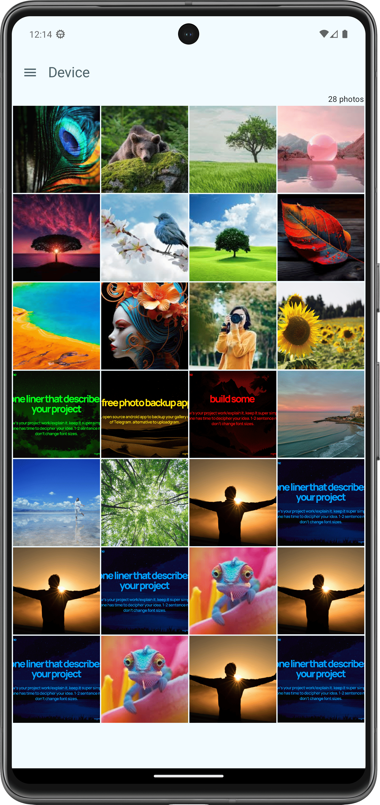
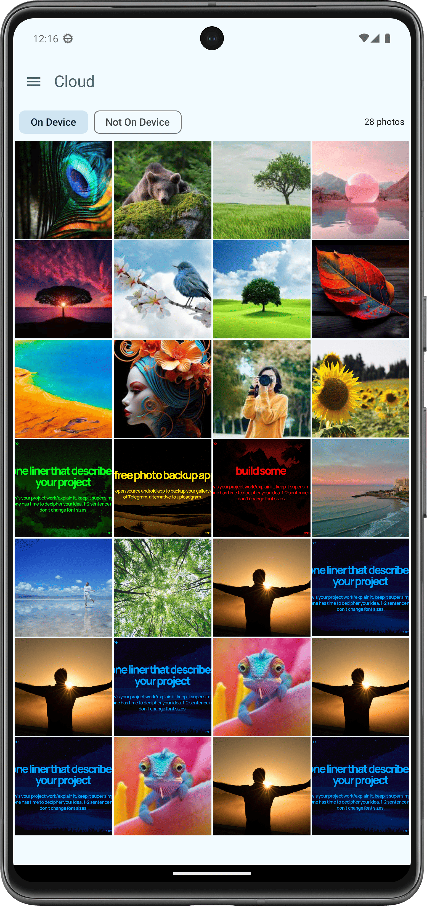
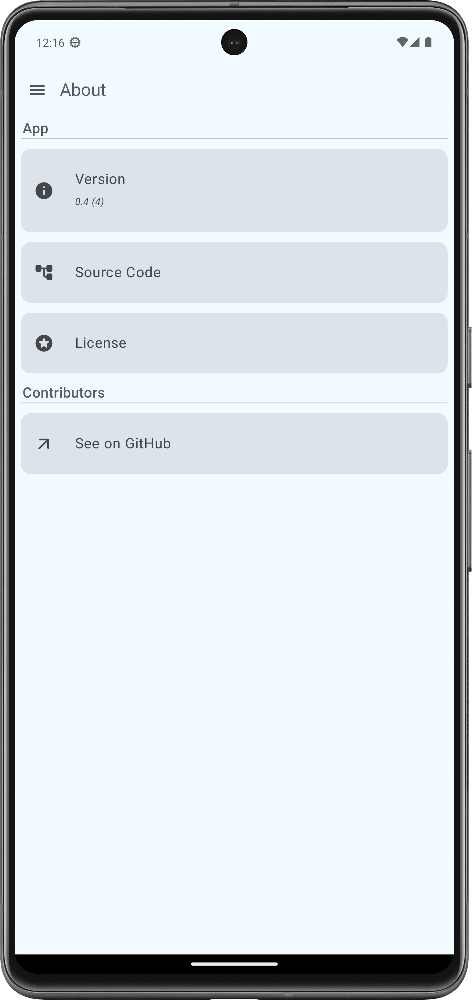

<!-- ---------- Header ---------- -->

  
  <h1>Whitehole</h1>

A feature-packed photo manager on top of Telegram.

<!-- ---------- Badges ---------- -->
  

    
    
    
    
    
     

<!-- ----------   Labels ---------- -->

 
  
  
  
  

<!-- ---------- Description ---------- -->

## Features

- [x] Create and manage backups
- [x] Complete customizability
- [x] Automatic periodic sync
- [x] Material Design 3 (You)
- [x] Written in Jetpack Compose
- [x] Entirely Open Source

> [!Note]
> This app requires access to a Telegram bot to manage your photos, keeping you in charge of your data and privacy. The bot and its owner are responsible for all operations(upload, download etc.) to and from Telegram and this app is just a client to interact with the bot. This app is not meant to and does not endorse spam or any other malicious activities. Please use it responsibly.

<!-- ---------- Download ---------- -->

## Download

<a href="https://github.com/beradeep/whitehole/releases"><a href="https://apt.izzysoft.de/fdroid/index/apk/com.bera.whitehole">

<!-- ---------- Usage ---------- -->

## Getting Started

- Visit BotFather on telegram and create a bot; you'll get a token.
- Open Whitehole app, paste the bot token and proceed.
- Now, you'll be asked for a unique id.
- Next create a private group, and add the bot to the group.
- To get the unique id, type `/start` in the group.
- Copy and paste the unique id the app and proceed.
- Voilà! Your app is ready to use.

<!-- ---------- Screenshots ---------- -->

## Screenshots

  
  
  
  

<!-- ---------- Contribution ---------- -->

## Feedback and contributions

***All contributions are very welcome!***

* Bug reports and feature requests can be submitted [here](https://github.com/beradeep/whitehole/issues).
* If you are a developer and wish to contribute to the app, please **fork** the project and submit a [pull request
  ](https://help.github.com/articles/about-pull-requests/). Go through [CONTRIBUTING.md](https://github.com/beradeep/whitehole/blob/master/CONTRIBUTING.md) before contributing.

## Credits

* [kotlin-telegram-bot](https://github.com/kotlin-telegram-bot) for the Telegram bot library.
* [Material Icons](https://material.io/resources/icons/) for the icons.
